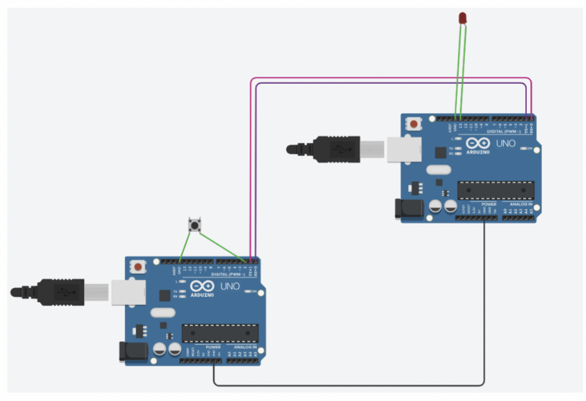
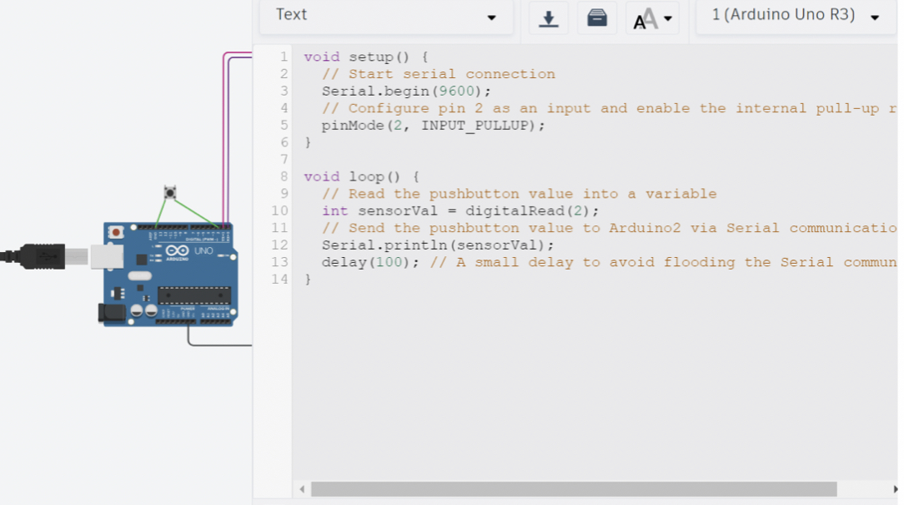
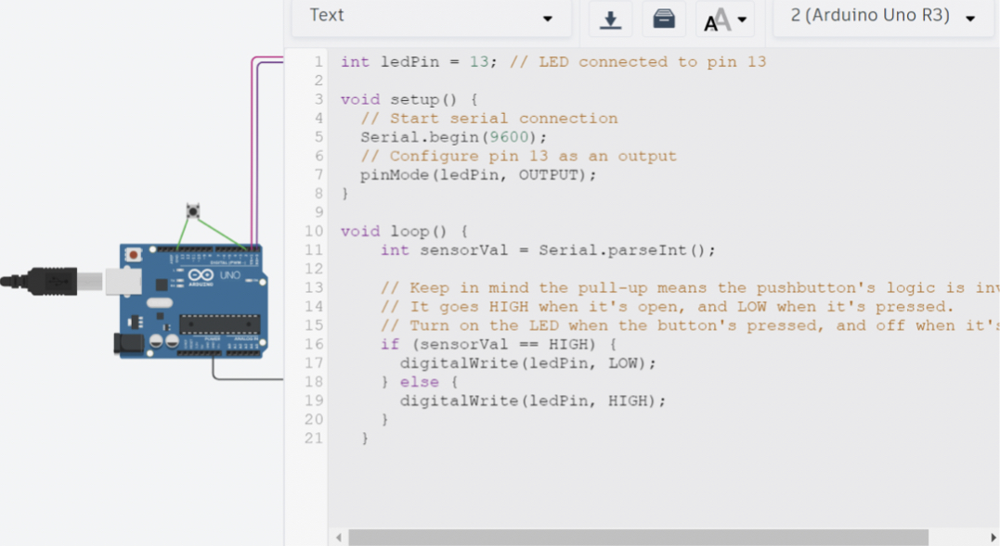

# Connecting-two-controllers-together
use I2C communication protocol in Tinkercad for connect two Arduino controllers together 
### Project Idea :-
the first controller reads the the push of button and sends it to the second controller, which controls an LED

 ### the sender arduino code 

 ### the reciver arduino code
 
